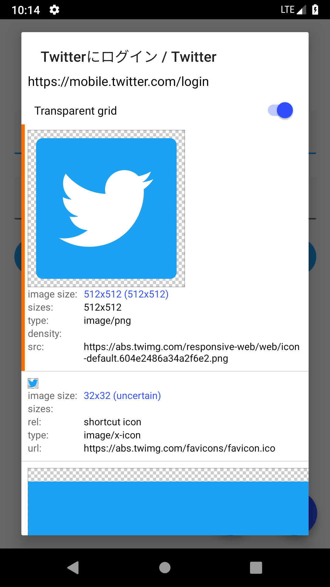
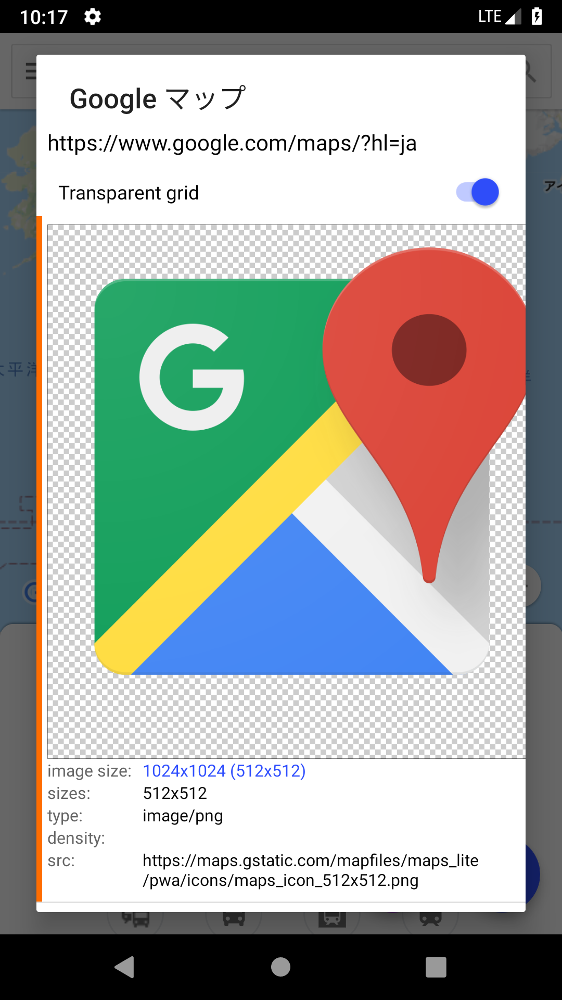

# touch-icon-extractor
[](./LICENSE)
[](https://github.com/ohmae/touch-icon-extractor/releases)
[](https://github.com/ohmae/touch-icon-extractor/issues)
[](https://github.com/ohmae/touch-icon-extractor/issues?q=is%3Aissue+is%3Aclosed)
[](https://bintray.com/ohmae/maven/net.mm2d.touchicon)
[](https://bintray.com/ohmae/maven/net.mm2d.touchicon)

This is a library for android for extracting apple-touch-icon information from the website.

## Screenshots

This app is included as a [sample module](sample) in this repository.

||||
|-|-|-|

## How to use

You can download this library from jCenter.
```gradle
repositories {
    jcenter()
}
```

Add dependencies, as following.
```gradle
dependencies {
    implementation 'net.mm2d:touchicon:0.6.0'
    implementation 'net.mm2d:touchicon-http-okhttp:0.6.0' // If use OkHttp for HTTP access
    implementation 'net.mm2d:touchicon-html-jsoup:0.6.0'  // If use Jsoup for HTML parse
}
```

### Sample code

```kotlin
val extractor = TouchIconExtractor()                    // initialize
extractor.userAgent = "user agent string"               // option: set User-Agent
extractor.headers = mapOf("Cookie" to "hoge=fuga")      // option: set additional HTTP header
extractor.downloadLimit = 10_000                        // option: set download limit (default 64kB).
                                                        // <= 0 means no limit 
//...
GlobalScope.launch(Dispatchers.Main) {
    val job = async(Dispatchers.IO) {
        extractor.fromPage(siteUrl, true)               // Do not call from the Main thread
    }
    //...
}
```

If in RxJava

```kotlin
//...
Single.fromCallable { extractor.fromPage(url, true) }   // Do not call from the Main thread
        .subscribeOn(Schedulers.io())
        .observeOn(AndroidSchedulers.mainThread())
        .subscribe({ 
            //...
        }, {})
```

By default, this use HttpUrlConnection for HTTP access.
If you want to use OkHttp, use touchicon-http-okhttp module.

```kotlin
val extractor = TouchIconExtractor(
    httpClient = OkHttpAdapterFactory.create(OkHttpClient())
)
```

And, this use a simple in-house parser for HTML parsing.
If you want to use Jsoup, use touchicon-html-jsoup module.

```kotlin
val extractor = TouchIconExtractor(
    htmlParser = JsoupHtmlParserAdapterFactory.create()
)
```

## Operating principle
   
There are two kinds of methods for specifying the WebClip icon.
This library supports both.

### Icon associated with the wab page

Specify the following description in the HTML header.

```html
<link rel="icon" href="/favicon.ico" type="image/x-icon">
<link rel="shortcut icon" href="/favicon.ico">
<link rel="apple-touch-icon" href="/apple-touch-icon.png" sizes="57x57">
<link rel="apple-touch-icon-precomposed" href="/apple-touch-icon-precomposed.png" sizes="80x80">
```

If you want this information, as following

```kotlin
extractor.fromPage(url)
```

This library attempts to download an HTML file from the specified URL.
Since only the header is required, if the download size is larger than a certain size, the download is stopped there.

Analyzing the downloaded HTML file,
Extract only link tags whose rel attribute is
"icon", "shortcut icon", "apple-touch-icon", "apple-touch-icon-precomposed".
Parse it, create an `PageIcon` instance, and return it as a result.

### Web App Manifest

Although not strictly a WebClip icon, this can also get an icon written in the Web App Manifest.

This is described by the following JSON.

```json
{
  "short_name": "AirHorner",
  "name": "Kinlan's AirHorner of Infamy",
  "icons": [
    {
      "src": "launcher-icon-1x.png",
      "type": "image/png",
      "sizes": "48x48"
    },
    {
      "src": "launcher-icon-2x.png",
      "type": "image/png",
      "sizes": "96x96"
    },
    {
      "src": "launcher-icon-4x.png",
      "type": "image/png",
      "sizes": "192x192"
    }
  ],
  "start_url": "index.html?launcher=true"
}
```

And it is described as follows in HTML.

```html
<link rel="manifest" href="/manifest.json">
```

This information is expressed as `WebAppIcon`.

If you want this information, as following

```kotlin
extractor.fromPage(url, true)
```

As you guessed, it gets at the same time as PageIcon.

### Icon associated with the Domain

Simply putting a file with a fixed name like "favicon.ico" in the root of the domain.
Whether an icon exists or not can not be known until you try HTTP communication.

This is an inefficient, but there are Web sites that are still deployed in this way.
You should try only if you can not get it by the method in the previous section

If you want this information, as following

```kotlin
extractor.fromDomain(url)
```

It checks whether or not the file exists, and returns the information if it exists.

The order of checking the existence of the icon is as follows

1. apple-touch-icon-precomposed.png
2. apple-touch-icon.png
3. favicon.ico

If the file exists, the subsequent files will not be checked.

If you do not need precomposed, as following

```kotlin
extractor.fromDomain(url, false)
```

The order of checking the existence of the icon is as follows
1. apple-touch-icon.png
1. favicon.ico

Sometimes the size information is included in the name, such as "apple-touch-icon-120x120.png"

When

```kotlin
extractor.fromDomain(url, true, listOf("120x120", "72x72"))
```

The order of checking the existence of the icon is as follows
1. apple-touch-icon-120x120-precomposed.png
2. apple-touch-icon-120x120.png
3. apple-touch-icon-72x72-precomposed.png
4. apple-touch-icon-72x72.png
5. apple-touch-icon-precomposed.png
6. apple-touch-icon.png
7. favicon.ico

There are methods to gather all the information (`TouchIconExtractor#listFromDomain()`)
This is for debugging and verification, **strongly recommended not to use in production.**.

### Comparison of icons

Often you can get more than one icon.
Which is the most appropriate icon depends on the application, but this library provides several Comparator.

```kotlin
val icons = extractor.fromDomain(url, true, listOf("120x120", "72x72"))
val bestIcon1 = icons.maxWith(IconComparator.SIZE)     // Compare by size. (the largest icon is the best)
val bestIcon2 = icons.maxWith(IconComparator.REL_SIZE) // Compare by rel, if same, compare by size
```

## API document

I am writing documentation comments using KDoc.

- [touchicon](https://ohmae.github.io/touch-icon-extractor/touchicon/index.html)
- [touchicon-http-okhttp](https://ohmae.github.io/touch-icon-extractor/touchicon-http/okhttp/index.html)
- [touchicon-html-jsoup](https://ohmae.github.io/touch-icon-extractor/touchicon-html/jsoup/index.html)

## Dependent OSS

### touchicon

- [Kotlin](https://kotlinlang.org/)
  - kotlin-stdlib-jdk7
- [Android Jetpack](https://developer.android.com/jetpack/)
  - androidx.annotation:annotation

### touchicon-http-okhttp

- [Kotlin](https://kotlinlang.org/)
  - kotlin-stdlib-jdk7
- [OkHttp3](https://square.github.io/okhttp/)

### touchicon-html-jsoup

- [Kotlin](https://kotlinlang.org/)
  - kotlin-stdlib-jdk7
- [Jsoup](https://jsoup.org/)

### sample app
- [Kotlin](https://kotlinlang.org/)
  - kotlin-stdlib-jdk7
  - kotlinx-coroutines-core
  - kotlinx-coroutines-android
- [Android Support Library](https://developer.android.com/topic/libraries/support-library/)
  - androidx.legacy:legacy-support-v4
  - androidx.appcompat:appcompat
  - androidx.constraintlayout:constraintlayout
  - com.google.android.material:material
- [Glide](https://bumptech.github.io/glide/)

## Author
大前 良介 (OHMAE Ryosuke)
http://www.mm2d.net/

## License
[MIT License](./LICENSE)
